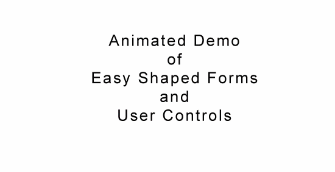



## Shaped Form&\#8217;s, Transparent Controls\. EASY  just select mask color for the UserControl

### Description

This user control allows ease of use in making a shaped form or even transparent controls like buttons and picture box&#8217;s. Just drag the control onto your form and select the mask color properties to select the color that will become transparent. Very simple to use, a single control and 0 lines of code in your forms.
 
### More Info
 

             |
---                |---
**Submitted On**   |2005-10-02 23:07:28
**By**             |[Chad Gutowsky](https://github.com/Planet-Source-Code/PSCIndex/blob/master/ByAuthor/chad-gutowsky.md)
**Level**          |Beginner
**User Rating**    |4.9 (49 globes from 10 users)
**Compatibility**  |VB 6\.0
**Category**       |[Custom Controls/ Forms/  Menus](https://github.com/Planet-Source-Code/PSCIndex/blob/master/ByCategory/custom-controls-forms-menus__1-4.md)
**World**          |[Visual Basic](https://github.com/Planet-Source-Code/PSCIndex/blob/master/ByWorld/visual-basic.md)
**Archive File**   |[Shaped\_For1936951032005\.zip](https://github.com/Planet-Source-Code/chad-gutowsky-shaped-form-8217-s-transparent-controls-easy-just-select-mask-color-for-the-__1-62752/archive/master.zip)

